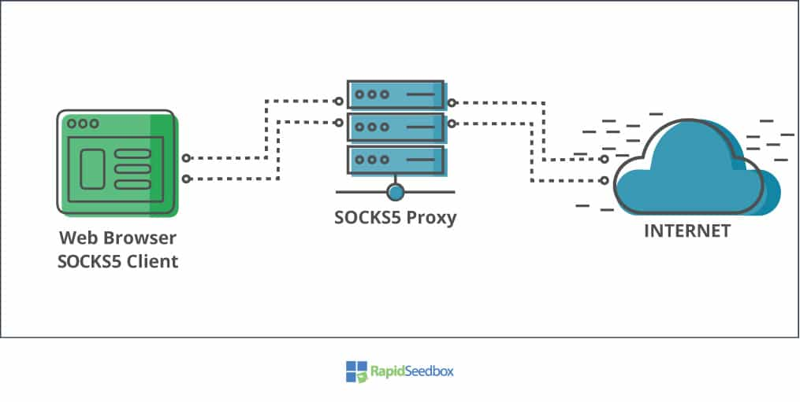
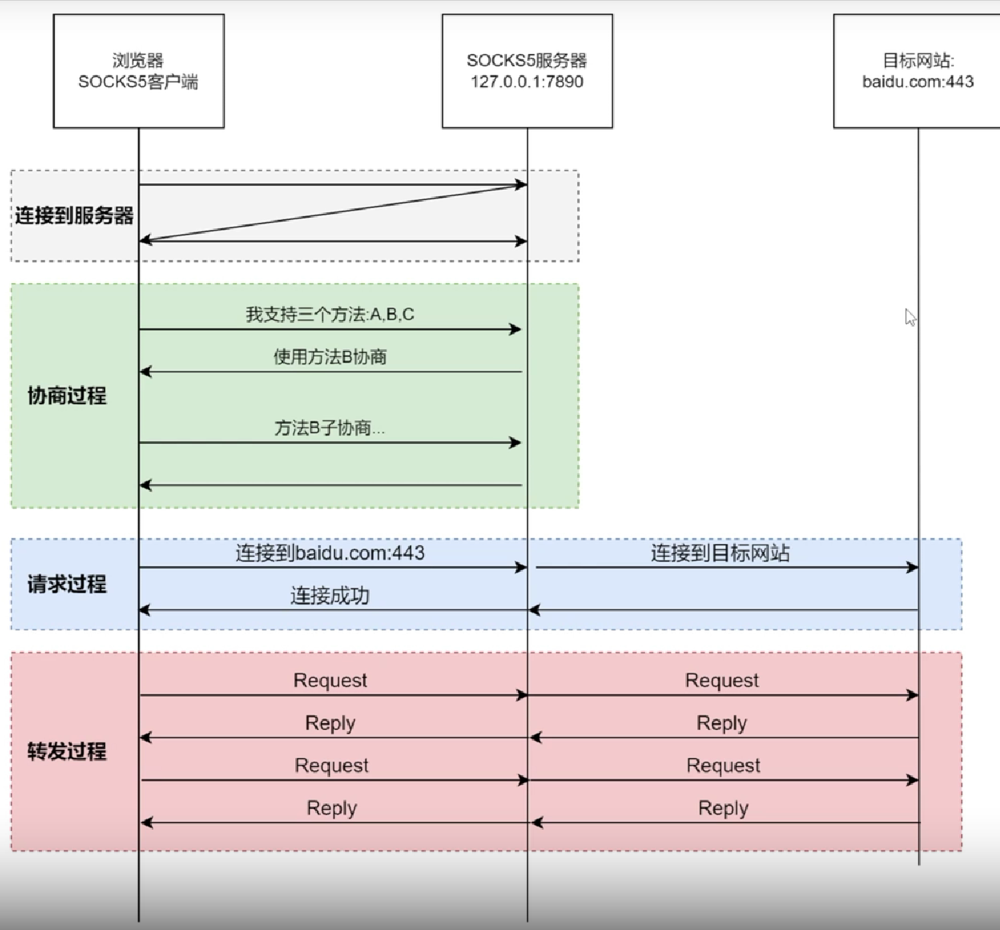
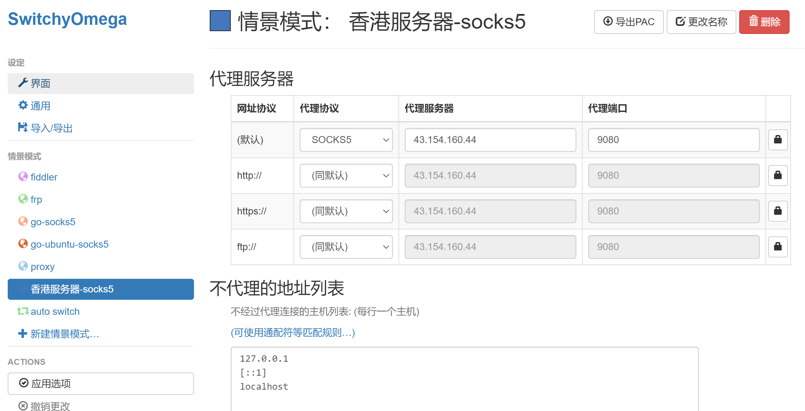

# 用Go实现Socket5代理

## socket5

对于广大的中国网友来说，一提到代理，肯定会想到翻墙，而socks5作为一种代理协议，肯定也能用来翻墙嘛。不过遗憾的是，虽然它是代理协议，然而并不能用于翻墙。因为它的数据都是明文传输，会被墙轻易阻断。

socks协议历史悠久，它面世时中国的互联网尚未成型，更别说墙，因此它并不是为翻墙而设计的协议。互联网早期，企业内部网络为了保证安全性，都是置于防火墙之后，这样带来的副作用就是访问内部资源会变得很麻烦，socks协议就是为了解决这个问题而诞生的。

socks相当于在防火墙撕了一道口子，让合法的用户可以通过这个口子连接到内部，从而访问内部的一些资源和进行管理。

socks5顾名思义就是socks协议的第五个版本，作为socks4的一个延伸，在socks4的基础上新增**UDP转发**和**认证功能**。唯一遗憾的是socks5并不兼容socks4协议。socks5由IETF在1996年正式发布，经过这么多年的发展，互联网上基本上都以socks5为主，socks4已经退出了历史的舞台。

实际上，你并不需要回头去看socks4协议，因为socks5协议完全可以取代socks4，因此读者对此不必感觉有心理压力。

socks5代理简要的工作流程，我们可以把它的的过程总结为3个阶段，分别为:握手阶段、请求阶段，Relay阶段。

1. 浏览器和socks5代理建立TCP连接

   和上面不同的时，浏览器和服务器之间多了一个中间人，即socks5，因此浏览器需要跟socks5服务器建立一条连接。

2. socks5协商阶段

   在浏览器正式向socks5服务器发起请求之前，双方需要协商，包括协议版本，支持的认证方式等，双方需要协商成功才能进行下一步。协商的细节将会在下一小节详细描述。

3. socks5请求阶段

   协商成功后，浏览器向socks5代理发起一个请求。请求的内容包括，它要访问的服务器域名或ip，端口等信息。

4. socks5 relay阶段

   scoks5收到浏览器请求后，解析请求内容，然后向目标服务器建立TCP连接。

5. 数据传输阶段

   经过上面步骤，我们成功建立了浏览器 –> socks5，socks5–>目标服务器之间的连接。这个阶段浏览器开始把数据传输给scoks5代理，socks5代理把数据转发到目标服务器。

### 交互流程图

### 参考链接

[理解socks5协议的工作过程和协议细节](https://wiyi.org/socks5-protocol-in-deep.html)

## 测试

### curl

curl --proxy socks5://127.0.0.1:8080 www.baidu.com  -v

### 浏览器使用

## TODO

- [ ] socks5通道数据加密(需要写一个客户端)
- [ ] 采用zap或者其他日志库
- [ ] 日志进mongodb
- [ ] client连接池
- [ ] 从命令行读取参数
- [ ] makefile

## 参考链接

[用Go实现TCP连接的双向拷贝](https://zhuanlan.zhihu.com/p/29657180)

[Go语言手写SOCKS5服务器](https://www.bilibili.com/video/BV15Y411c7SU)

[github开源socks5项目](https://github.com/shikanon/socks5proxy)

[理解socks5协议的工作过程和协议细节](https://wiyi.org/socks5-protocol-in-deep.html)

[socks5协议原理学习](https://cloud.tencent.com/developer/article/1802233)

